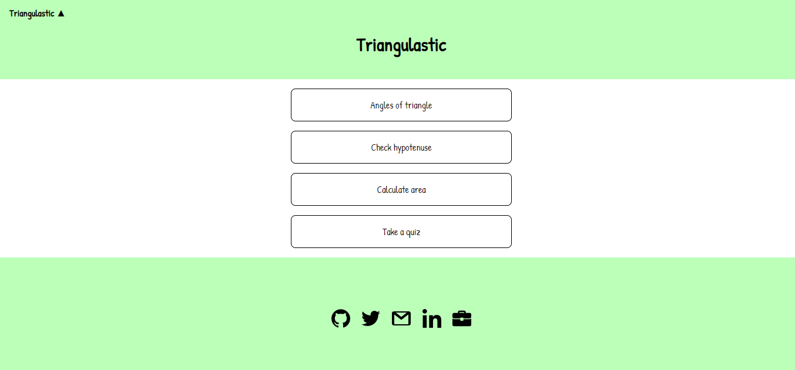

# know-triangle
A handy calculator for calculations related to triangles.  
This app has four sections:  
Angles of the triangle: input three angles and this app will let you know if it is a triangle.  
Check hypotenuse: find the hypotenuse after giving input for known two sides of a triangle.  
Calculate area: three ways to calculate area a)If you have base and height length. b)If you have the length of 3 sides c)If you have the length of 2 sides and included angle.  
Take a quiz: check your knowledge by solving 10 MCQs.  
Live app: https://triangulastic.netlify.app/   
  